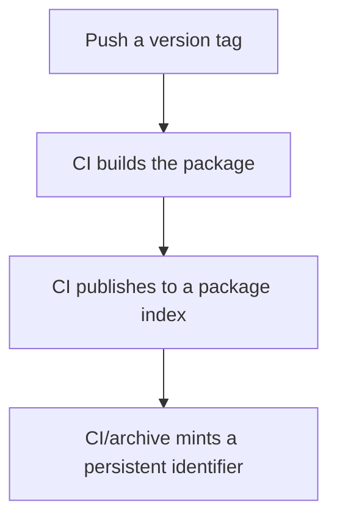

::: {.callout-note}
## FAIR contribution

The guide primarily supports the following FAIR principles:

**Reusable**

- Tagged releases let others identify and reuse a specific, stable version of your software.
- Packaging your software makes it easy for others to install and reuse it in their own work.

**Accessible**

- Published packages let others obtain a working copy of your software without building it from source themselves.

:::

# Why versioning and packaging matter

Code in a repository changes constantly. That is fine for development, but it is a problem the moment someone else needs to depend on your software—install it, cite it, or reproduce a result that used it. "The latest version on the main branch" is not a stable thing to point to.

Versioning and packaging solve this by turning a moving target into something others can reliably install, reference, and build on. This guide assumes you already use version control day-to-day; it focuses specifically on how to turn commits into releases people can depend on. If you need a refresher on version control itself, see [Version Control with Git](https://swcarpentry.github.io/git-novice) (Software Carpentry), [The Turing Way's chapter on version control](https://book.the-turing-way.org/reproducible-research/vcs), or RSQKit's lesson on [using version control](https://everse.software/RSQKit/using_version_control).

# Principle 1: Use semantic versioning

Semantic versioning (SemVer) gives version numbers a shared meaning, in the form `MAJOR.MINOR.PATCH`:

| Segment | Increment when |
|---|---|
| MAJOR | You make a change that breaks existing usage |
| MINOR | You add functionality in a backwards-compatible way |
| PATCH | You fix a bug without changing behaviour otherwise |

A user who sees a MINOR version bump knows they can upgrade safely. A MAJOR bump tells them to check for breaking changes first. This shared meaning is what makes version numbers useful information rather than an arbitrary counter. See RSQKit's lesson on [software identifiers](https://everse.software/RSQKit/software_identifiers) for how version numbers fit into the broader picture of identifying software.

# Principle 2: Tag your releases

A release is simply a specific commit marked as a stable point in time. Git tags do this directly:

```text
git tag -a v1.0.0 -m "First stable release"
git push origin v1.0.0
```

On GitHub, pushing a tag can also be turned into a formal Release, with release notes attached. This gives every version a permanent, citable reference—unlike a branch name or commit on `main`, which keeps moving. See RSQKit's lesson on [releasing software](https://everse.software/RSQKit/releasing_software) for more on structuring this process.

# Principle 3: Package your software for distribution

Packaging bundles your code together with the metadata needed to install it—its name, version, and dependencies—so others can install it with a single command instead of cloning and configuring it by hand.

Most ecosystems have a standard packaging format: `pip`/PyPI for Python, CRAN or Bioconductor for R, npm for JavaScript. The details differ, but the goal is the same: a minimal metadata file describing your package, and a build step that turns your source code into an installable artifact. See RSQKit's lesson on [packaging software](https://everse.software/RSQKit/packaging_software) for a closer look.

A minimal Python example (`pyproject.toml`):

```toml
[project]
name = "my-project"
version = "1.0.0"
dependencies = ["numpy"]
```

# Principle 4: Automate releases with CI/CD

Manual release steps are easy to skip or do inconsistently—forgetting to bump the version, or publishing from the wrong branch. Automating the release process removes this risk.

A common pattern: pushing a version tag triggers a CI job that builds the package and publishes it.



That last step connects directly to citation: once a release is archived with a persistent identifier, it can be cited precisely. See [Making research software citable](10citations.qmd).

# Take-away

Versioning and packaging turn your software from a moving target into something others can install, depend on, and reference precisely. Tag your releases, follow a consistent versioning scheme, and automate the process so it happens the same way every time.

# Related guides

Continue improving your software by exploring:

- [Testing research software](2testing.qmd)
- [Making research software citable](10citations.qmd)
