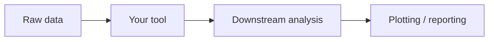

::: {.callout-note}
## FAIR contribution

The guide primarily supports the following FAIR principle:

**Interoperable**

- Standard data formats and interfaces let your software exchange data with other tools without custom glue code.
- Machine-readable metadata lets registries and workflow tools discover and combine your software automatically.

:::

# Why interoperability matters

Research software rarely works alone. Its output usually becomes another tool's input: a simulation feeds an analysis script, an analysis script feeds a plotting tool, and the whole chain might run inside a larger pipeline. Interoperability is what makes that chain possible without someone writing custom conversion code at every step.

Software that only "works" in isolation, with a custom format or a one-off interface, forces everyone downstream to write glue code around it. Software built on standard formats and interfaces slots into pipelines other people already have.

# Principle 1: Use open, standard data formats

Whenever a standard format already exists for your kind of data, prefer it over inventing your own. A custom binary format might be marginally more efficient, but it also means every other tool needs bespoke support just to read your output.

| Domain | Common standard formats |
|---|---|
| Tabular data | CSV, Parquet |
| Structured records | JSON, YAML |
| Large numerical arrays | HDF5, NetCDF, Zarr |
| Sequence data (life sciences) | FASTA, FASTQ, VCF |

Standard formats also come with existing libraries in most languages, so adopting one usually means writing *less* I/O code, not more.

# Principle 2: Follow standard interface conventions

The same idea applies to how your software is invoked, not just the data it reads and writes.

- **Command-line tools** should read from stdin and write to stdout where sensible, use conventional flags (`--help`, `--version`), and return a non-zero exit code on failure. This lets them be chained with pipes and used from scripts without special-casing.
- **Services and APIs** should follow REST conventions and standard HTTP status codes, and ideally publish an [OpenAPI](https://www.openapis.org/) specification describing their endpoints, so other tools can call them without reading your source code first.

Both cases share the same goal: someone should be able to combine your software with another tool by reading a short, standard convention—not by reverse-engineering your particular choices.

# Principle 3: Describe your interfaces with machine-readable metadata

A human can read a README to learn what a tool expects as input. A registry, workflow manager, or search tool cannot—it needs that information in a structured, machine-readable form.

[CodeMeta](https://codemeta.github.io/) captures general software metadata (language, dependencies, related publications), as covered in [Making research software citable](10citations.qmd). Domain-specific vocabularies go further: the [EDAM ontology](https://edamontology.org/), widely used in the life sciences, provides controlled terms for operations, data types, and formats, so tools can be matched by what they actually do rather than by name alone. See RSQKit's lesson on [software metadata](https://everse.software/RSQKit/software_metadata) for how to start describing your software this way.

# Principle 4: Make your software composable in workflows

Computational workflows chain multiple tools into a single, automated pipeline. Software that is easy to drop into one—rather than requiring a special wrapper—gets reused far more often.

Workflow managers such as [Snakemake](https://snakemake.readthedocs.io/), [Nextflow](https://www.nextflow.io/), and the [Common Workflow Language (CWL)](https://www.commonwl.org/) expect tools to behave predictably from the command line: clear inputs and outputs, and no interactive prompts or hidden state. Registries like [WorkflowHub](https://workflowhub.eu/) and [nf-core](https://nf-co.re/) also make it easier for others to discover pipelines that already use your tool, or to build one that does. See RSQKit's lesson on [computational workflows](https://everse.software/RSQKit/computational_workflows) for how to choose and document a workflow system.

# Take-away

Interoperability is less about any single feature and more about not making unnecessary custom choices: standard formats instead of a bespoke one, standard interfaces instead of a special one, and metadata that describes both in a form other tools can read. Each of these is what lets your software become one piece of a larger pipeline instead of an isolated dead end.

# Related guides

Continue improving your software by exploring:

- [Documenting research software](4documentation.qmd)
- [Publishing research software](1repositories.qmd)
- [Providing a demo environment](6demo_environment.qmd)
